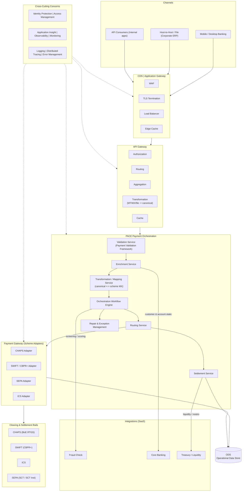
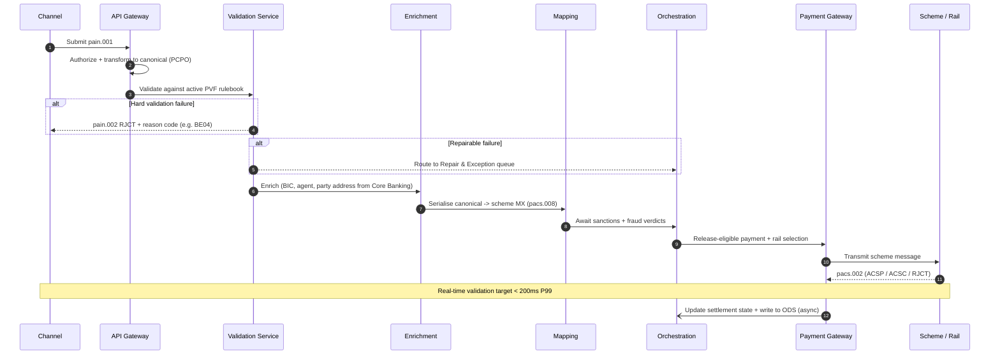
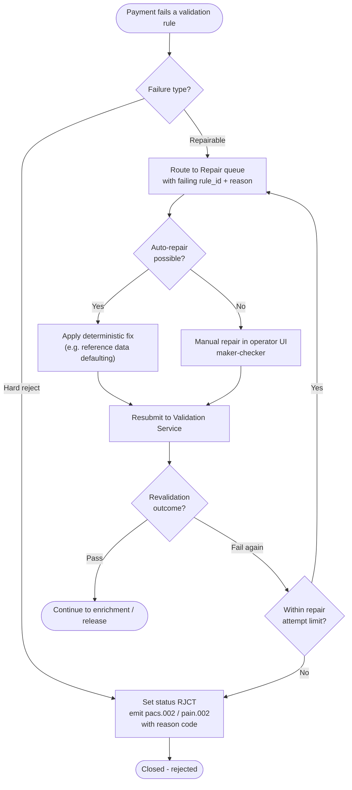
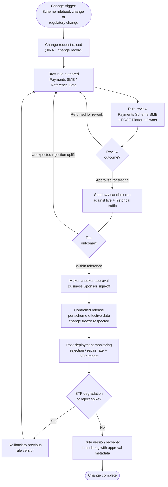

# PACE Payments Middleware – Sample Reference Architecture

**PACE — Payments Acceptance, Clearing & Execution Engine**

> *This is a sample, fictional reference architecture produced for demonstration purposes. The platform ("PACE"), the institution ("A Bank"), and all sample figures are illustrative and do not represent any real system or organisation.*

---

## Table of Contents

1. [Overview](#1-overview)
2. [Purpose and Role in the Payment Lifecycle](#2-purpose-and-role-in-the-payment-lifecycle)
3. [Architecture Overview](#3-architecture-overview)
4. [Core Components](#4-core-components)
5. [Payment Message Model](#5-payment-message-model)
6. [Payment Validation Framework (PVF)](#6-payment-validation-framework-pvf)
7. [Scheme and Regulatory Coverage](#7-scheme-and-regulatory-coverage)
8. [Integration Landscape](#8-integration-landscape)
9. [Key Processes](#9-key-processes)
10. [Non-Functional Characteristics](#10-non-functional-characteristics)
11. [Governance and Control](#11-governance-and-control)
12. [Glossary](#12-glossary)

---

## 1. Overview

The **PACE platform (Payments Acceptance, Clearing & Execution Engine)** is A Bank's **middleware payments processing engine**. It sits between the bank's customer channels and core banking systems on one side, and the external clearing and settlement rails on the other. PACE is the authoritative processing layer that **validates, enriches, transforms, orchestrates, routes, and clears** payment instructions across all sterling, euro, and cross-border payment types.

PACE operates as a set of shared payment services consumed by the Corporate and Investment Bank (CIB), the Commercial Bank, and the Retail Bank. It is rail-agnostic at the channel and orchestration layers and rail-specific only at the gateway layer, where it adapts the bank's internal **canonical payment object** to the message format and rulebook required by each scheme.

PACE is **ISO 20022-native**. All internal processing operates on ISO 20022 (MX) structures. Legacy MT message flows and host-to-host file formats are translated into the canonical model at ingress and back out at the gateway. A payment instruction cannot be released to a rail unless it has passed the active **Payment Validation Framework (PVF)** rulebook for that scheme and message type.

### Key facts (*Sample*)

| Attribute | Value |
|---|---|
| Payment rails connected | CHAPS, SWIFT (CBPR+), SEPA (SCT and SCT Inst), ICS |
| Message standards supported | ISO 20022 (pacs, pain, camt), legacy SWIFT MT (run-off), Bacs Standard 18, host-to-host file |
| Validation rules managed | 850+ |
| Scheme and regulatory rulebooks tracked | 12+ |
| Straight-Through Processing (STP) rate target | 95%+ |
| Real-time validation latency target | < 200ms P99 (single payment, RTGS/instant path) |
| Throughput | 2,000+ payments per second at peak |
| Daily volume | 4.5M+ payment instructions per day |
| Availability SLA | 99.95% (CHAPS operating window); 24x7 for SEPA Instant |
| Audit retention | 7 years (scheme rulebook + regulatory requirement) |

---

## 2. Purpose and Role in the Payment Lifecycle

PACE operates across the **validation, orchestration, and clearing** phases of the payment lifecycle. It acts as the gate that every outbound payment must pass before it can be released to a scheme, and the entry point that every inbound payment must pass before it is posted to a customer account.

### Position in the payment lifecycle

```
[Initiation] --> [Ingress & Auth] --> [Validation & Enrichment] --> [Orchestration & Routing] --> [Clearing & Settlement] --> [Posting & Confirmation] --> [Reporting]
                                              |                              |                              |
                                       PACE validation               PACE routing                 PACE gateway
                                       PASS = release-eligible        rail selection                scheme submission
                                       FAIL = repair or reject        per scheme rulebook            ISO 20022 (MX)
```

### What PACE does

The PACE decision and processing scope spans five domains:

| Domain | What is done | Examples |
|---|---|---|
| **Message validation** | Is the message well-formed, schema-valid, and compliant with the scheme usage guideline? | XML schema validation; CBPR+ / scheme network validation; party and address validation; IBAN/BIC validation |
| **Enrichment** | Is the instruction complete enough to clear and settle straight-through? | BIC derivation from IBAN; agent lookup; purpose code defaulting; charge bearer normalisation |
| **Transformation** | Is the instruction expressed in the format the target rail requires? | Canonical → pacs.008 (CBPR+); canonical → SEPA SCT; MT103 → canonical (inbound legacy) |
| **Orchestration** | Are all dependent checks satisfied and sequenced correctly? | Sanctions screening hook; fraud scoring hook; duplicate detection; limit and liquidity checks |
| **Routing & clearing** | Which rail, and is the instruction released and settled correctly? | Rail selection by currency/agent/urgency; cut-off handling; settlement confirmation reconciliation |

### What PACE does not do

- PACE does not originate payments (it does not replace channels or core banking initiation).
- PACE does not maintain customer or account static data (it consumes it).
- PACE does not perform the sanctions or fraud decision itself (it orchestrates calls to specialist SaaS services and acts on their verdicts).
- PACE does not own the general ledger; it instructs posting and consumes confirmation.

---

## 3. Architecture Overview

### 3.1 Layered architecture

PACE follows the bank's Payments Shared Services reference architecture: a layered design from edge to rail, with cross-cutting security, observability, and error-management concerns running vertically through every layer.



### 3.2 Layer responsibilities

| Layer | Responsibility |
|---|---|
| **Channels** | Mobile/desktop banking, corporate host-to-host file submission, internal API consumers. Source of payment initiation messages (pain.001, file batches, MT). |
| **CDN \| Application Gateway** | Edge security and traffic management: Web Application Firewall (WAF), TLS termination, load balancing (LB), edge caching. |
| **API Gateway** | Authorization, request routing, response aggregation, and first-pass transformation of inbound formats into the PACE canonical model. Caching of reference lookups. |
| **PACE Payment Orchestration** | The middleware processing core: validation, enrichment, mapping, workflow orchestration, routing, settlement, and repair/exception handling. |
| **Integrations (SaaS)** | Externalised specialist services: Fraud Check, Core Banking (customer/account static), Treasury (liquidity/nostro). |
| **Payment Gateway** | Scheme-specific adapters that serialise the canonical object into the exact ISO 20022 (or legacy) message the rail requires and manage connectivity. Writes to the ODS. |
| **Clearing & Settlement Rails** | CHAPS (Bank of England RTGS), SWIFT (CBPR+ cross-border), SEPA (SCT and SCT Inst), ICS (UK Image Clearing System). |

### 3.3 Deployment model

PACE is deployed as a set of independently versioned microservices on the bank's private cloud (on-premises data centres with regulated cloud burst capability). The Validation Service and the Payment Gateway adapters are the latency-critical and connectivity-critical components and are deployed in resilient active-active pairs adjacent to the scheme connectivity zone. Scheme adapters are isolated so that a rulebook change for one rail can be released without redeploying the orchestration core.

---

## 4. Core Components

### 4.1 API Gateway and Ingress

Receives payment instructions from all channels, authorizes the caller, and performs the **first-pass transformation** of the inbound format (pain.001, MT, or host-to-host file) into the PACE **canonical payment object**.

**Functions:**
- Authenticate and authorize the channel/consumer (mTLS, OAuth2, scope checks)
- Detect inbound format and version (pain.001.001.09, MT103, file profile)
- Transform inbound message into the canonical payment object
- Reject malformed or unparseable messages before they reach orchestration

### 4.2 Validation Service (Payment Validation Framework)

The core compliance runtime of PACE. Evaluates every payment against the active **Payment Validation Framework (PVF)** rulebook for the applicable scheme and message type. (See [Section 6](#6-payment-validation-framework-pvf).)

**Functions:**
- Execute validation rules in deterministic priority order
- Support rule types: schema rules, network/usage-guideline rules, presence rules, format rules, enumeration rules, cross-reference rules
- Return a structured result per rule: `PASS`, `REJECT`, or `REPAIR`
- Support sandbox/shadow execution of new rules against live traffic without affecting outcomes

### 4.3 Enrichment Service

Completes the canonical object so the payment can clear straight-through.

**Functions:**
- Derive BIC from IBAN (and validate against the BIC directory)
- Resolve creditor/debtor agent details and intermediary chain
- Source customer and account static data from Core Banking (including party name and **postal address**)
- Default or normalise purpose codes, charge bearer, and category purpose where permitted by the scheme

### 4.4 Transformation / Mapping Service

Maps the canonical object to and from the exact scheme message structure. This is where the bank's internal model is serialised into pacs.008 (CBPR+), SEPA SCT, CHAPS, or legacy MT, and where inbound scheme messages are parsed back into the canonical model.

**Functions:**
- Canonical → scheme MX (pacs.008, pacs.009, SEPA pacs/pain) serialisation
- Inbound scheme MX → canonical parsing
- MT ↔ MX translation for legacy coexistence flows
- Field-level mapping governed by versioned, scheme-specific mapping definitions

### 4.5 Orchestration Workflow Engine

Sequences all dependent checks and external calls for each payment, and decides the next state.

**Orchestration logic:**
- Any `REJECT` result from validation produces a payment status of `RJCT` with an ISO 20022 reason code
- A `REPAIR` result routes the payment to the Repair & Exception queue
- Sanctions and fraud verdicts are awaited before release; a hit suspends the payment
- All `PASS` with no `REPAIR` and clean screening produces a release-eligible payment

### 4.6 Routing Service

Selects the appropriate rail and scheme variant for each release-eligible payment.

**Routing logic:**
- Rail selection by currency, debtor/creditor agent, urgency, and value (e.g., GBP high-value → CHAPS; EUR → SEPA; cross-border → SWIFT CBPR+)
- Applies the scheme- and message-type-specific rulebook version and effective date to the validation profile
- Honours scheme cut-off windows and business calendars

### 4.7 Settlement Service

Manages settlement state, liquidity, and reconciliation of confirmations.

**Functions:**
- Reserve and confirm liquidity with Treasury
- Track settlement state per payment (`ACSP`, `ACSC`, `RJCT`)
- Reconcile inbound confirmations (pacs.002, camt.054) against released payments

### 4.8 Repair & Exception Management

Handles every payment that cannot proceed straight-through.

**Functions:**
- Hold failed payments in a repair queue with the failing rule ID and reason
- Support auto-repair (deterministic fixes, e.g., reference data defaulting) and manual repair (operator UI, maker-checker)
- Resubmit repaired payments to validation, or reject with a scheme-compliant status report
- Generate exception reporting to the Payment Operations team

### 4.9 Payment Gateway and Scheme Adapters

Manages physical connectivity to each rail and the final serialisation/transmission of messages, and writes the operational record to the ODS.

**Functions:**
- Maintain scheme connectivity (SWIFT Alliance, CHAPS/RTGS interface, SEPA gateway)
- Apply scheme-specific message profile and rulebook version at the point of transmission
- Receive scheme acknowledgements and status reports and route them back to Settlement
- Persist the operational record of every payment to the ODS

### 4.10 Audit and Logging Service

Every validation result, transformation, external call, and state transition is written to an immutable, append-only audit log.

**Retention:** 7 years (scheme rulebook recordkeeping + regulatory requirement)

**Log record contains:** payment reference, end-to-end ID, timestamp, rule ID, canonical snapshot, scheme message snapshot, decision/state, operator/system ID.

---

## 5. Payment Message Model

This section defines the message structures PACE processes. It is the reference for any change that affects message content, party data, or field-level validation.

### 5.1 ISO 20022 message types in scope

| Message | Name | Direction | Use |
|---|---|---|---|
| pain.001 | Customer Credit Transfer Initiation | Inbound (channel) | Customer/corporate payment initiation |
| pain.002 | Customer Payment Status Report | Outbound (channel) | Status back to the initiating channel |
| pacs.008 | FI to FI Customer Credit Transfer | Inbound / Outbound (rail) | Interbank customer credit transfer (CBPR+, CHAPS, SEPA) |
| pacs.009 | Financial Institution Credit Transfer | Inbound / Outbound (rail) | Bank-to-bank credit transfer |
| pacs.002 | FI to FI Payment Status Report | Inbound / Outbound (rail) | Acceptance (`ACSP`/`ACSC`) or rejection (`RJCT`) with reason code |
| pacs.004 | Payment Return | Inbound / Outbound (rail) | Return of a previously settled payment |
| camt.052/053/054 | Bank-to-Customer Cash Management | Inbound / Outbound | Account report, statement, debit/credit notification |
| camt.056 | FI to FI Payment Cancellation Request | Inbound / Outbound | Recall/cancellation request |

### 5.2 Canonical payment object (PACE Canonical Payment Object – PCPO)

Internally, all messages are normalised into the PCPO. Each party (debtor, creditor, ultimate parties, agents) carries name, identification, account, and a structured **postal address** block.

```json
{
  "payment_id": "PCPO-2026-06-22-000456789",
  "end_to_end_id": "E2E-ACME-0099123",
  "instruction_id": "INSTR-77123",
  "message_type": "pacs.008",
  "scheme": "CBPR+",
  "settlement_method": "INDA",
  "interbank_amount": { "currency": "GBP", "value": 125000.00 },
  "charge_bearer": "SHAR",
  "value_date": "2026-06-23",
  "purpose_code": "SUPP",
  "debtor": {
    "name": "Northwind Manufacturing Ltd",
    "account": { "iban": "GB29NWBK60161331926819" },
    "agent_bic": "NWBKGB2L",
    "postal_address": {
      "address_format": "STRUCTURED",
      "street_name": "King William Street",
      "building_number": "25",
      "post_code": "EC4N 7AF",
      "town_name": "London",
      "country": "GB",
      "address_lines": []
    }
  },
  "creditor": {
    "name": "Acme Trading Ltd",
    "account": { "iban": "DE89370400440532013000" },
    "agent_bic": "COBADEFF",
    "postal_address": {
      "address_format": "UNSTRUCTURED",
      "street_name": null,
      "building_number": null,
      "post_code": null,
      "town_name": null,
      "country": null,
      "address_lines": [
        "Unit 4, Riverside Business Park",
        "120 Hafenstrasse, 60311 Frankfurt, DE"
      ]
    }
  }
}
```

> **Note on current state:** The `postal_address` block supports all three ISO 20022 address formats. The `address_format` enum may currently be `UNSTRUCTURED`, `STRUCTURED`, or `HYBRID`, and the orchestration layer **accepts all three** for legacy and coexistence reasons. The structured component fields are populated only when the source channel or Core Banking provides them.

### 5.3 The ISO 20022 PostalAddress structure

The ISO 20022 `PostalAddress` element (`<PstlAdr>`) appears under every party. It can be expressed in three formats. The discrete sub-elements are:

| Element | Tag | Description |
|---|---|---|
| Department | `Dept` | Department within an organisation |
| Sub Department | `SubDept` | Sub-division of a department |
| Street Name | `StrtNm` | Name of the street |
| Building Number | `BldgNb` | Number of the building |
| Building Name | `BldgNm` | Name of the building |
| Floor | `Flr` | Floor within the building |
| Post Box | `PstBx` | Numbered box in a post office |
| Room | `Room` | Room/unit within the building |
| Post Code | `PstCd` | Postal code |
| Town Name | `TwnNm` | Town/city name |
| Town Location Name | `TwnLctnNm` | Specific location within the town |
| District Name | `DstrctNm` | District |
| Country Sub Division | `CtrySubDvsn` | State/region/province |
| Country | `Ctry` | ISO 3166 alpha-2 country code |
| Address Line | `AdrLine` | Free-text address line (the unstructured element) |

### 5.4 Address format variants

The same creditor address can be expressed three ways. These examples are the canonical reference for any address-related change.

**(a) Unstructured** — only free-text `AdrLine` elements, no discrete components:

```xml
<Cdtr>
  <Nm>Acme Trading Ltd</Nm>
  <PstlAdr>
    <AdrLine>Unit 4, Riverside Business Park</AdrLine>
    <AdrLine>120 Hafenstrasse, 60311 Frankfurt, DE</AdrLine>
  </PstlAdr>
</Cdtr>
```

**(b) Hybrid** — Town Name and Country provided as discrete elements; remaining detail in `AdrLine`:

```xml
<Cdtr>
  <Nm>Acme Trading Ltd</Nm>
  <PstlAdr>
    <TwnNm>Frankfurt</TwnNm>
    <Ctry>DE</Ctry>
    <AdrLine>Unit 4, Riverside Business Park</AdrLine>
    <AdrLine>120 Hafenstrasse, 60311</AdrLine>
  </PstlAdr>
</Cdtr>
```

**(c) Structured** — fully discrete components, no `AdrLine`:

```xml
<Cdtr>
  <Nm>Acme Trading Ltd</Nm>
  <PstlAdr>
    <StrtNm>Hafenstrasse</StrtNm>
    <BldgNb>120</BldgNb>
    <BldgNm>Riverside Business Park</BldgNm>
    <Room>Unit 4</Room>
    <PstCd>60311</PstCd>
    <TwnNm>Frankfurt</TwnNm>
    <Ctry>DE</Ctry>
  </PstlAdr>
</Cdtr>
```

### 5.5 Party fields carrying a PostalAddress

PostalAddress appears under the following party elements. All are in scope for any address-format change.

| Party | Tag | Notes |
|---|---|---|
| Initiating Party | `InitgPty` | pain.001 only |
| Debtor | `Dbtr` | Ordering customer |
| Debtor Agent | `DbtrAgt` | Ordering bank |
| Ultimate Debtor | `UltmtDbtr` | On whose behalf the debtor acts |
| Creditor | `Cdtr` | Beneficiary |
| Creditor Agent | `CdtrAgt` | Beneficiary bank |
| Ultimate Creditor | `UltmtCdtr` | Ultimate beneficiary |
| Intermediary Agents | `IntrmyAgt1..3` | Correspondent chain |

---

## 6. Payment Validation Framework (PVF)

The PVF is the rule-driven engine that decides whether a payment is released, repaired, or rejected. It is the payments equivalent of a business rule management system, and the primary surface that scheme and regulatory changes act upon.

### 6.1 Rule taxonomy

Validation rules are organised into domains, each tied to a scheme rulebook or usage guideline where applicable.

| Domain | Sub-domain | Example rules |
|---|---|---|
| Syntax & Schema | Well-formedness | Message parses; valid against ISO 20022 XSD for the declared version |
| Network / Scheme | Usage guideline | CBPR+ network validation; CHAPS enhanced-data rules; SEPA EPC rulebook rules |
| Party & Address | Presence | Debtor present; Creditor present; party address present |
| Party & Address | Format | Country code valid; post code present where required; **address format permitted** |
| Account & Agent | Identifiers | IBAN check digit; BIC in directory; account-to-BIC consistency |
| Reference Data | Enumerations | Currency (ISO 4217); purpose code; charge bearer; category purpose |
| Amount & Date | Limits and value | Amount within channel/scheme limit; value date not in the past; cut-off respected |
| Compliance | Screening orchestration | Sanctions screening verdict; fraud score within threshold; duplicate detection |

### 6.2 Rule lifecycle

```
[Draft] --> [Review] --> [Approved] --> [Active] --> [Deprecated]
               |                           |
           Returned                   Superseded by
           for rework                 new rule version
```

Each rule version is immutable once approved; changes create a new version. The superseded version is retained in the audit log.

### 6.3 Rule structure (standard template)

| Field | Description |
|---|---|
| rule_id | Unique identifier (e.g. PVR-ADDR-001) |
| rule_name | Short descriptive name |
| domain | One of: SYNTAX_SCHEMA, NETWORK_SCHEME, PARTY_ADDRESS, ACCOUNT_AGENT, REFERENCE_DATA, AMOUNT_DATE, COMPLIANCE |
| scheme_reference | Scheme rulebook / usage guideline driving the rule (e.g. CBPR+, CHAPS, SEPA SCT) |
| message_type_scope | Message types the rule applies to (e.g. pacs.008, pain.001) |
| party_scope | Party elements the rule applies to (e.g. Cdtr, Dbtr, UltmtCdtr) |
| priority | Integer; lower = evaluated first |
| condition | Logical condition evaluated against the canonical object |
| pass_action | Action when condition is met (typically: continue) |
| reject_action | Action and ISO 20022 reason code when the condition fails hard |
| repair_action | Action when the failure is repairable (route to repair queue) |
| effective_from | Date rule becomes active |
| effective_to | Date rule is superseded (null if current) |
| version | Integer, increments on each approved change |
| owner | Business owner (team/role) |
| last_reviewed | Date of last SME review |

### 6.4 Sample rules (current state)

The following rules are illustrative of the active rulebook. Note in particular the **party and address rules**, which currently enforce *presence* and *country validity* but accept any of the three address formats.

| Rule ID | Domain | Scheme ref | Condition | Action on fail |
|---|---|---|---|---|
| PVR-SCH-001 | Syntax & Schema | All | `message validates against declared ISO 20022 XSD` | REJECT: `FF01` invalid file/format |
| PVR-ADDR-001 | Party & Address | CBPR+ / CHAPS | `Cdtr.PstlAdr present (AdrLine OR any structured component)` | REPAIR / REJECT: `BE04` creditor address missing |
| PVR-ADDR-002 | Party & Address | CBPR+ / CHAPS | `Dbtr.PstlAdr present (AdrLine OR any structured component)` | REPAIR / REJECT: `BE07` debtor address missing |
| PVR-ADDR-010 | Party & Address | CBPR+ | `IF Ctry present THEN Ctry IN ISO_3166_alpha2` | REPAIR: invalid country code |
| PVR-ACCT-020 | Account & Agent | SEPA / CBPR+ | `Cdtr.IBAN check digit valid (ISO 13616)` | REJECT: `AC01` incorrect account number |
| PVR-ACCT-031 | Account & Agent | CBPR+ | `CdtrAgt.BIC IN BIC_directory` | REPAIR: BIC not found |
| PVR-REF-040 | Reference Data | All | `Ccy IN ISO_4217` | REJECT: `AM03` invalid currency |
| PVR-REF-045 | Reference Data | CHAPS | `IF scheme = CHAPS THEN Purp.Cd IS NOT NULL` | REPAIR: purpose code required |
| PVR-AMT-050 | Amount & Date | All | `value_date >= business_date` | REPAIR: back-valued date |
| PVR-CMP-060 | Compliance | All | `sanctions_verdict = CLEAR AND fraud_score < threshold` | HOLD: refer to investigation |
| PVR-CMP-070 | Compliance | All | `payment NOT duplicate within window` | HOLD: suspected duplicate |

> **Current-state observation (for change-impact use):** There is **no active rule that enforces a permitted address format**. PVR-ADDR-001 and PVR-ADDR-002 check that an address is *present* in any format. A payment whose `Cdtr.PstlAdr` contains only `AdrLine` elements (i.e. `address_format = UNSTRUCTURED`) currently passes validation and is released. The discrete-element rules (e.g. PVR-ADDR-010) only fire *if* a structured component is already present.

### 6.5 Reject mechanism

When a payment fails a hard validation rule, PACE sets the transaction status to `RJCT` and emits the appropriate status report (pacs.002 to the rail / network, pain.002 to the originating channel) carrying an **External Status Reason Code**. Relevant codes for party/address failures include:

| Reason code | Meaning |
|---|---|
| `BE04` | Missing or incorrect creditor (beneficiary) address |
| `BE07` | Missing or incorrect debtor address |
| `RR04` | Regulatory reason |
| `NARR` | Narrative — free-text reason detail accompanies the rejection |

---

## 7. Scheme and Regulatory Coverage

### 7.1 Schemes and rulebooks in scope (*Sample*)

| Scheme / Rail | Governing body | Message standard | Address handling in current rulebook |
|---|---|---|---|
| **SWIFT cross-border** | SWIFT (CBPR+ usage guidelines) | ISO 20022 (pacs.008, pacs.009, pacs.002) | CBPR+ guidelines require **structured or hybrid** address; fully unstructured addresses are to be **rejected**. Coexistence with unstructured ended under the CBPR+ migration timeline. |
| **CHAPS** | Bank of England (RTGS) | ISO 20022 (enhanced data) | CHAPS enhanced-data rules require purpose codes, LEI for certain flows, and **structured/hybrid** addresses; unstructured no longer permitted for in-scope parties. |
| **SEPA (SCT / SCT Inst)** | European Payments Council (EPC rulebooks) | ISO 20022 (native) | EPC rulebooks moving party addresses to structured/hybrid; AddressLine usage being restricted. |
| **ICS** | UK Image Clearing System | Sterling cheque image (non-ISO 20022) | Out of scope for ISO 20022 address structuring. |

### 7.2 Regulatory / scheme driver — ISO 20022 structured address requirement

The cross-border and high-value schemes have mandated, via their ISO 20022 usage guidelines and rulebooks, that party postal addresses must be supplied in **structured** or **hybrid** format, and that messages carrying a **fully unstructured** address for an in-scope party are to be **rejected**. Where the hybrid format is used, **Town Name (`TwnNm`)** and **Country (`Ctry`)** must be provided as discrete elements, with remaining detail permitted in a limited number of `AdrLine` elements.

**Current state of PACE against this requirement:** PACE is fully capable of representing, parsing, and serialising all three address formats (Section 5). However, the Payment Validation Framework **does not currently enforce a permitted-format rule** (Section 6.4). PACE therefore continues to accept and release payments carrying unstructured party addresses. Bringing PACE into line with the scheme requirement — rejecting unstructured addresses and permitting only structured or hybrid — is the change that this architecture is intended to support assessment of.

### 7.3 Rulebook-to-rule traceability

Every validation rule with a scheme driver carries a `scheme_reference` linking it to the rulebook or usage guideline that drives it. This enables:
- Change-impact assessment when a scheme rulebook or usage guideline changes
- Evidence of compliance for scheme audit and regulatory examination
- Structured change management when new rules are introduced or amended

---

## 8. Integration Landscape

### 8.1 Upstream sources

| System | Data provided | Protocol | Frequency |
|---|---|---|---|
| Channels (Mobile/Desktop) | pain.001 payment initiation | REST / API | Real-time |
| Host-to-Host / Corporate ERP | File batches (pain.001, custom) | SFTP / file | Batch (intraday windows) |
| Core Banking | Customer and account static data, including **party name and postal address** | Internal API | Real-time + daily batch |
| Reference Data Service | ISO 3166 country codes, ISO 4217 currencies, purpose codes, BIC directory, IBAN structure | Internal API | Daily batch + on-demand |
| Sanctions Screening (SaaS) | Screening verdict | API | Real-time |
| Fraud Check (SaaS) | Fraud score / verdict | API | Real-time |
| Treasury / Liquidity | Liquidity and nostro positions | Internal API | Real-time |

### 8.2 Downstream consumers

| System | Data consumed | Use |
|---|---|---|
| CHAPS / SWIFT / SEPA / ICS rails | Scheme MX (or legacy) messages | Clearing and settlement |
| Operational Data Store (ODS) | Operational record of every payment and status | Operational queries, investigations, MI |
| Regulatory & Scheme Reporting | Payment data, rejection statistics, reason codes | Scheme compliance reporting; regulatory returns |
| General Ledger / Posting | Settlement instructions and confirmations | Customer and nostro posting |
| Channels (status) | pain.002 / notifications | Status back to initiating customer |
| Compliance & Operations Dashboard | Audit trail, rejections, repair rates, STP trends | Monitoring and management reporting |

---

## 9. Key Processes

### 9.1 Outbound customer payment (channel to rail)

```
1. Channel submits pain.001 to the API Gateway
2. API Gateway authorizes and transforms to the canonical object (PCPO)
3. Validation Service executes the active PVF rulebook for the target scheme
4. Enrichment Service completes the object (BIC, agent, address from Core Banking)
5. Mapping Service serialises canonical -> scheme MX (e.g. pacs.008 CBPR+)
6. Orchestration awaits sanctions + fraud verdicts
7. Routing Service selects the rail; Payment Gateway transmits to the scheme
8. Settlement reconciles the scheme status report (pacs.002) and writes to ODS
```



### 9.2 Inbound interbank payment

```
1. Scheme delivers pacs.008 to the Payment Gateway
2. Mapping Service parses scheme MX -> canonical object
3. Validation Service applies inbound PVF rulebook for the scheme
4. On pass: Enrichment resolves the beneficiary account
5. Orchestration awaits sanctions screening verdict
6. Settlement posts to the beneficiary account (via Core Banking / GL)
7. pacs.002 acceptance status returned to the scheme; record written to ODS
8. On hard failure: pacs.002 RJCT returned with the relevant reason code
```

### 9.3 Repair and exception workflow



### 9.4 Validation rule change management



---

## 10. Non-Functional Characteristics

| Characteristic | Requirement |
|---|---|
| Validation latency | < 200ms P99 for a single real-time payment (RTGS / instant path) |
| Throughput | Minimum 2,000 payments per second at peak |
| Straight-Through Processing | 95%+ STP across all schemes |
| Availability | 99.95% during the CHAPS operating window; 24x7 for SEPA Instant |
| Settlement cut-offs | All cut-off windows and scheme business calendars honoured |
| Audit retention | 7 years, immutable, tamper-evident |
| Backward compatibility | Validation, mapping, and API changes must not break consumers without a versioned deprecation period |
| Disaster recovery | RTO < 15 minutes; RPO < 1 minute |
| Data residency | UK and EU payment data must remain in UK/EU data centres (UK GDPR / GDPR) |

---

## 11. Governance and Control

### 11.1 Ownership model

| Component | Business owner | Technology owner |
|---|---|---|
| PVF rulebook | Payments Operations Lead + Payments Scheme SME | PACE Platform Owner |
| Canonical model & mapping | Payments Architecture | Mapping Service Tech Lead |
| Scheme adapters | Payments Scheme SME | Gateway Tech Lead |
| Customer/account static data | Core Banking / Data Office | Core Banking Tech Lead |
| Audit log | Compliance | Technology |

### 11.2 Change control

- All PVF rule changes require maker-checker approval.
- Scheme-mandated and regulatory-driven changes require Payments Scheme SME sign-off.
- Changes expected to affect the STP rate or rejection rate by more than a defined threshold require Business Sponsor approval and a parallel run / shadow period.
- All changes are linked to a JIRA ticket and a BRD or change record, and are released against the relevant scheme effective date.

### 11.3 Audit and reporting

- Every payment carries a full canonical and scheme-message snapshot with the rule evaluation trace.
- Every `RJCT` generates an exception record routed to Payment Operations and the relevant scheme reporting feed.
- Monthly PVF coverage report: active rules by scheme; rules due for review; rules without a scheme reference.
- Quarterly scheme/regulatory horizon scan: upcoming rulebook and usage-guideline changes assessed against the PVF rulebook.

---

## 12. Glossary

| Term | Definition |
|---|---|
| PACE | Payments Acceptance, Clearing & Execution Engine — A Bank's middleware payments processing engine |
| PCPO | PACE Canonical Payment Object — the internal normalised representation of a payment |
| PVF | Payment Validation Framework — the rule-driven validation engine within PACE |
| ISO 20022 | Global standard for financial messaging; the MX message family |
| MX | ISO 20022 XML message (e.g. pacs.008) |
| MT | Legacy SWIFT message type (e.g. MT103) |
| pain.001 | ISO 20022 Customer Credit Transfer Initiation |
| pain.002 | ISO 20022 Customer Payment Status Report |
| pacs.008 | ISO 20022 FI to FI Customer Credit Transfer |
| pacs.009 | ISO 20022 Financial Institution Credit Transfer |
| pacs.002 | ISO 20022 FI to FI Payment Status Report (carries `ACSP`/`ACSC`/`RJCT`) |
| pacs.004 | ISO 20022 Payment Return |
| camt | ISO 20022 cash management messages (statements, notifications, cancellations) |
| CBPR+ | Cross-Border Payments and Reporting Plus — SWIFT ISO 20022 usage guidelines for cross-border payments |
| CHAPS | UK high-value sterling RTGS scheme, operated by the Bank of England |
| SEPA | Single Euro Payments Area |
| SCT / SCT Inst | SEPA Credit Transfer / SEPA Instant Credit Transfer |
| EPC | European Payments Council — owner of the SEPA rulebooks |
| ICS | Image Clearing System — UK cheque clearing |
| RTGS | Real-Time Gross Settlement |
| STP | Straight-Through Processing |
| BIC | Business Identifier Code (ISO 9362) |
| IBAN | International Bank Account Number (ISO 13616) |
| LEI | Legal Entity Identifier (ISO 17442) |
| PstlAdr | ISO 20022 PostalAddress element |
| AdrLine | Address Line — the free-text (unstructured) address element |
| TwnNm | Town Name element |
| Ctry | Country element (ISO 3166 alpha-2) |
| Structured address | Address using only discrete elements, no `AdrLine` |
| Hybrid address | Address combining discrete elements (mandatorily Town Name and Country) with limited `AdrLine` |
| Unstructured address | Address using only `AdrLine` free-text elements |
| External Status Reason Code | ISO 20022 code set giving the reason for a status (e.g. `BE04`, `BE07`, `RR04`) |
| RJCT / ACSP / ACSC | Rejected / Accepted Settlement in Process / Accepted Settlement Completed |
| Charge bearer | Party bearing the transaction charges (`DEBT`, `CRED`, `SHAR`, `SLEV`) |
| Purpose code | ISO 20022 code describing the purpose of the payment |
| ODS | Operational Data Store |
| WAF | Web Application Firewall |
| TLS | Transport Layer Security |
| Value date | The date on which the payment is to be settled |

---