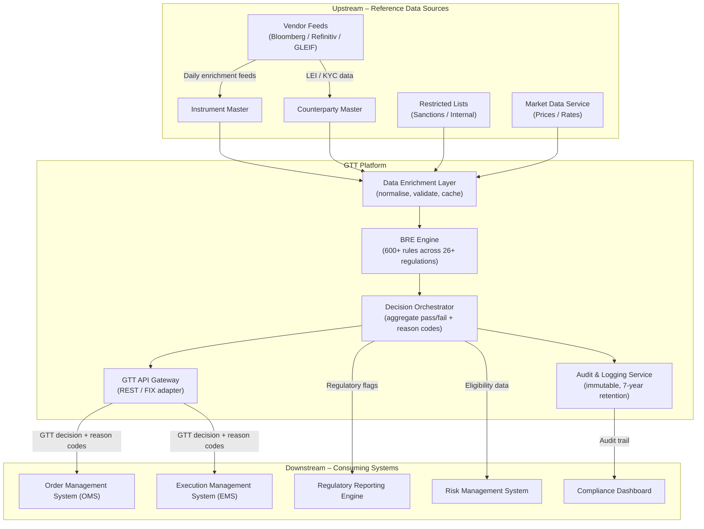
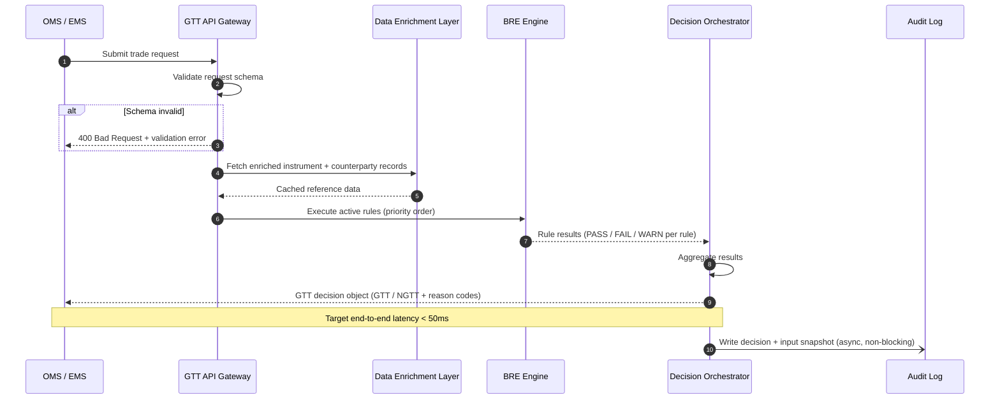
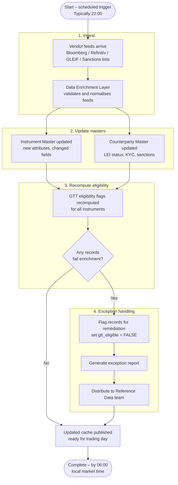
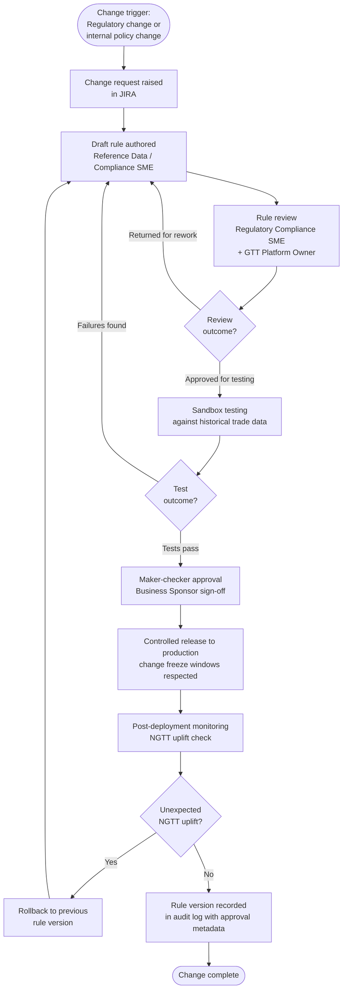

# Good-to-Trade (GTT) Platform – Sample Reference Architecture

---

## Table of Contents

1. [Overview](#1-overview)
2. [Purpose and Role in the Trade Lifecycle](#2-purpose-and-role-in-the-trade-lifecycle)
3. [Architecture Overview](#3-architecture-overview)
4. [Core Components](#4-core-components)
5. [Data Model](#5-data-model)
6. [Business Rule Engine (BRE) Framework](#6-business-rule-engine-bre-framework)
7. [Regulatory Coverage](#7-regulatory-coverage)
8. [Integration Landscape](#8-integration-landscape)
9. [Key Processes](#9-key-processes)
10. [Non-Functional Characteristics](#10-non-functional-characteristics)
11. [Governance and Control](#11-governance-and-control)
12. [Glossary](#12-glossary)

---

## 1. Overview

A **Good-to-Trade (GTT) platform** is a pre-trade decision engine that determines whether a financial instrument, counterparty, or proposed transaction is eligible to be traded. It sits at the intersection of Reference Data Management, Compliance, and Front Office operations.

The GTT platform is the authoritative system for trade eligibility decisions across all asset classes — equities, fixed income, derivatives, FX, and structured products — for both the Corporate and Investment Bank (CIB) and Retail Bank divisions.

The platform evaluates eligibility by executing a rulebook of **Business Rule Engines (BREs)** against reference data. A trade cannot proceed to execution unless it has received a GTT clearance. For this sample architecture, we can consider a binary decision: **Good to Trade (GTT)** or **Not Good to Trade (NGTT)**.

### Key facts (*Sample*)

| Attribute | Value |
|---|---|
| Number of BREs managed | 600+ |
| Regulatory frameworks covered | 26+ |
| Asset classes in scope | Equities, Fixed Income, Derivatives (OTC and ETD), FX, Structured Products, Securities Finance |
| Decision latency target | < 50ms (real-time); < 4h (batch enrichment) |
| Availability SLA | 99.95% during market hours |
| Audit retention | 7 years (MiFIR requirement) |

---

## 2. Purpose and Role in the Trade Lifecycle

The GTT platform operates in the **pre-trade** phase of the trade lifecycle. It acts as a gate that must be passed before an order is routed to an execution venue.

### Position in the trade lifecycle

```
[Order Intent] --> [GTT Check] --> [Order Routing] --> [Execution] --> [Post-Trade]
                        |
               PASS = Good to Trade
               FAIL = Not Good to Trade + reason code
```

### What GTT checks

The GTT decision is the aggregate result of checks across four domains:

| Domain | What is checked | Examples |
|---|---|---|
| **Instrument eligibility** | Is the instrument valid, fully enriched, and permitted for trading? | ISIN present; CFI Code valid; instrument not restricted; not on sanctions list |
| **Counterparty eligibility** | Is the counterparty permissioned, not sanctioned, and fully onboarded? | LEI validated; KYC complete; credit limit not breached; counterparty not on OFAC/SDN list |
| **Regulatory compliance** | Does the trade comply with applicable regulations? | MiFIR pre-trade transparency; Dodd Frank reporting eligibility; short sale restrictions; position limits |
| **Internal controls** | Does the trade comply with A Bank's internal trading policies? | Desk-level trading limits; restricted list (internal); product approval; conflicts of interest checks |

### What GTT does not do

- GTT does not execute trades.
- GTT does not calculate P&L or risk.
- GTT does not replace post-trade compliance monitoring.
- GTT does not manage order routing logic.

---

## 3. Architecture Overview

### 3.1 Mermaid Architecture Diagram



### 3.2 Deployment model

A Bank will perhaps deploy the GTT platform as a set of microservices running on a private cloud (on-premises data centres with cloud burst capability). Each component is independently deployable and versioned. The BRE Engine is the only component with strict latency requirements and is deployed in a co-location environment adjacent to the OMS.

---

## 4. Core Components

### 4.1 Data Enrichment Layer

Responsible for sourcing, normalising, and caching all reference data required by the BREs. Runs on a scheduled batch cycle (overnight) and supports real-time lookups for intraday enrichment gaps.

**Functions:**
- Ingest from Instrument Master, Counterparty Master, Restricted Lists, and Vendor Feeds
- Validate incoming data against schema and format rules
- Flag incomplete or invalid records before they reach the BRE Engine
- Maintain a cache of enriched instrument and counterparty records for low-latency BRE lookups

### 4.2 BRE Engine

The core execution runtime of the GTT platform. Evaluates each incoming trade or instrument against the active rulebook.

**Functions:**
- Execute rules in deterministic order (rule priority governs sequencing)
- Support four rule types: restriction rules, threshold rules, enumeration rules, cross-reference rules
- Return a structured decision object per rule: `PASS`, `FAIL`, or `WARN`
- Support sandbox execution for rule testing without impacting live traffic

### 4.3 Decision Orchestrator

Aggregates individual BRE outputs into a single GTT decision.

**Aggregation logic:**
- Any single `FAIL` result produces a GTT = NGTT outcome
- `WARN` results produce GTT = GTT with advisory flags attached
- All `PASS` with no `WARN` produces GTT = GTT (clean)

### 4.4 Audit and Logging Service

All decisions, rule evaluations, data inputs, and system events are written to an immutable append-only audit log.

**Retention:** 7 years (MiFIR Article 25; Dodd Frank recordkeeping rules)

**Log record contains:** trade reference, timestamp, rule ID, input data snapshot, decision output, user/system ID

### 4.5 GTT API Gateway

Exposes GTT decisions to downstream consumers via:
- **REST API** for internal system-to-system calls
- **FIX adapter** for OMS/EMS integration (FIX tag 9XXX extension for GTT status)

---

## 5. Data Model

### 5.1 Core entities

The GTT platform operates against five core entities. Each entity is sourced from an upstream master data system.

```
┌─────────────────────┐        ┌──────────────────────┐
│     INSTRUMENT      │        │    COUNTERPARTY       │
├─────────────────────┤        ├──────────────────────┤
│ isin           PK   │        │ lei             PK   │
│ cfi_code            │        │ legal_name           │
│ instrument_name     │        │ bic                  │
│ asset_class         │        │ domicile_country     │
│ currency            │        │ kyc_status           │
│ issuer_lei     FK   │◄──────►│ sanctions_status     │
│ mic                 │        │ credit_rating        │
│ admission_date      │        │ onboarding_date      │
│ firds_reportable    │        │ counterparty_type    │
│ short_sale_flag     │        └──────────────────────┘
│ rwa_class           │
│ gtt_eligible        │        ┌──────────────────────┐
│ last_enriched_dt    │        │   RESTRICTED_LIST    │
└─────────────────────┘        ├──────────────────────┤
                               │ list_id         PK   │
┌─────────────────────┐        │ list_type            │
│   TRADE_REQUEST     │        │ isin / lei      FK   │
├─────────────────────┤        │ restriction_type     │
│ trade_ref      PK   │        │ effective_from       │
│ instrument_id  FK   │        │ effective_to         │
│ counterparty_id FK  │        │ source_authority     │
│ desk_id             │        └──────────────────────┘
│ trader_id           │
│ side                │        ┌──────────────────────┐
│ quantity            │        │    GTT_DECISION      │
│ notional            │        ├──────────────────────┤
│ trade_date          │        │ decision_id     PK   │
│ requested_at        │        │ trade_ref       FK   │
└──────────┬──────────┘        │ decision             │
           │                   │   (GTT / NGTT)       │
           └──────────────────►│ reason_codes[]       │
                               │ rules_evaluated      │
                               │ rules_failed         │
                               │ decided_at           │
                               │ ttl_ms               │
                               └──────────────────────┘
```

### 5.2 Instrument entity – key attributes

| Attribute | Type | Mandatory | Description |
|---|---|---|---|
| isin | VARCHAR(12) | Yes | ISO 6166 instrument identifier |
| cfi_code | VARCHAR(6) | Yes (FIRDS-reportable) | ISO 10962 classification |
| instrument_name | VARCHAR(350) | Yes | Full instrument name |
| asset_class | ENUM | Yes | EQUITY, FIXED_INCOME, DERIVATIVE, FX, STRUCTURED |
| currency | VARCHAR(3) | Yes | ISO 4217 |
| issuer_lei | VARCHAR(20) | Yes | LEI of issuer (GLEIF validated) |
| mic | VARCHAR(4) | Conditional | ISO 10383 market identifier code |
| admission_date | DATE | Conditional | Date admitted to regulated trading venue |
| firds_reportable | BOOLEAN | Yes | Whether instrument is in scope for FIRDS submission |
| short_sale_flag | BOOLEAN | Yes | Whether short sale identification applies |
| rwa_class | VARCHAR(50) | Yes | Basel 3.1 RWA classification |
| gtt_eligible | BOOLEAN | Derived | Computed by GTT platform; not stored in source |
| last_enriched_dt | TIMESTAMP | Yes | Last vendor enrichment timestamp |

### 5.3 GTT Decision object – structure

```json
{
  "decision_id": "GTT-2025-03-18-000123456",
  "trade_ref": "TRD-987654321",
  "decision": "NGTT",
  "decided_at": "2025-03-18T08:42:11.204Z",
  "ttl_ms": 12,
  "rules_evaluated": 47,
  "rules_failed": 1,
  "reason_codes": [
    {
      "rule_id": "GTT-BRE-001",
      "domain": "INSTRUMENT_ELIGIBILITY",
      "status": "FAIL",
      "description": "CFI Code absent or invalid for FIRDS-reportable instrument",
      "regulation": "MiFIR RTS 23 – Field 3a"
    }
  ],
  "advisory_flags": []
}
```

---

## 6. Business Rule Engine (BRE) Framework

### 6.1 Rule taxonomy

BREs are organised into four domains, each subdivided by regulation or control type.

| Domain | Sub-domain | Example rules |
|---|---|---|
| Instrument Eligibility | Data completeness | ISIN present; CFI Code valid; LEI of issuer verified |
| Instrument Eligibility | Instrument status | Not matured; not suspended; not on internal restricted list |
| Instrument Eligibility | Regulatory flags | FIRDS reportable check; short sale flag present |
| Counterparty Eligibility | Sanctions | Not on OFAC/SDN; not on EU Consolidated Sanctions list; not on HMT list |
| Counterparty Eligibility | KYC / Onboarding | KYC status = COMPLETE; onboarding not expired |
| Counterparty Eligibility | Credit | Credit limit not breached; counterparty credit rating meets minimum threshold |
| Regulatory Compliance | MiFIR | RTS 23 completeness; pre-trade transparency waiver check; systematic internaliser status |
| Regulatory Compliance | Dodd Frank | SEC section eligibility; CFTC swap reporting obligation |
| Regulatory Compliance | UK PRA / Basel 3.1 | RWA class populated and valid; derivatives counterparty risk classification |
| Regulatory Compliance | Position limits | EMIR commodity derivative position limits; MiFID II position limit regime |
| Internal Controls | Desk policy | Desk-level trading mandate; product approval status |
| Internal Controls | Conflicts | Internal watch list; front-running prevention |

### 6.2 Rule lifecycle

```
[Draft] --> [Review] --> [Approved] --> [Active] --> [Deprecated]
               |                           |
           Returned                   Superseded by
           for rework                 new rule version
```

Each rule version is immutable once approved. Changes produce a new version. The previous version is retained in the audit log.

### 6.3 Rule structure (standard template)

| Field | Description |
|---|---|
| rule_id | Unique identifier (e.g. GTT-BRE-001) |
| rule_name | Short descriptive name |
| domain | One of: INSTRUMENT_ELIGIBILITY, COUNTERPARTY_ELIGIBILITY, REGULATORY_COMPLIANCE, INTERNAL_CONTROLS |
| regulation_reference | Regulation and article/RTS driving the rule (if applicable) |
| priority | Integer; lower = evaluated first |
| condition | The logical condition evaluated against the enriched data |
| pass_action | Action when condition is met (typically: continue) |
| fail_action | Action when condition is not met (typically: NGTT + reason code) |
| warn_action | Action when condition is met with caveats |
| effective_from | Date rule is active |
| effective_to | Date rule is superseded (null if current) |
| version | Integer, increments on each approved change |
| owner | Business owner (team/role) |
| last_reviewed | Date of last SME review |

### 6.4 Sample rules

| Rule ID | Domain | Condition | Fail action |
|---|---|---|---|
| GTT-BRE-001 | Instrument Eligibility | `isin IS NOT NULL AND cfi_code MATCHES ^[A-Z]{6}$` | NGTT: Missing or invalid CFI Code |
| GTT-BRE-042 | Instrument Eligibility | `IF commodity_derivative_indicator = TRUE THEN commodity_subtype IS NOT NULL` | NGTT: Commodity sub-type required for commodity derivatives |
| GTT-BRE-107 | Counterparty Eligibility | `counterparty.lei IS NOT NULL AND lei_gleif_status = ACTIVE` | NGTT: Counterparty LEI absent or lapsed |
| GTT-BRE-215 | Regulatory Compliance | `IF trade.side = SHORT THEN instrument.short_sale_flag IS NOT NULL` | NGTT: Short sale flag absent on instrument |
| GTT-BRE-330 | Regulatory Compliance | `instrument.rwa_class IS NOT NULL AND rwa_class IN (valid_basel3_enum)` | NGTT: RWA class missing or not Basel 3.1 compliant |
| GTT-BRE-412 | Counterparty Eligibility | `counterparty.sanctions_status NOT IN (OFAC_SDN, EU_CONSOLIDATED, HMT)` | NGTT: Counterparty on active sanctions list |
| GTT-BRE-500 | Internal Controls | `instrument.internal_restricted_list_flag = FALSE` | NGTT: Instrument on internal restricted list |

---

## 7. Regulatory Coverage

### 7.1 Frameworks in scope (*Sample*)

| Regulation | Governing Body | Scope | GTT Impact |
|---|---|---|---|
| MiFID II / MiFIR | ESMA (EU) | Instrument reference data; pre-trade transparency; transaction reporting | RTS 22, 23, 24 BREs; FIRDS submission completeness checks |
| Dodd Frank Act | SEC / CFTC (US) | Securities lending transparency; short sale; swap reporting | Sections 984, 929X(a); swap dealer eligibility checks |
| UK CRR / CRD (Basel 3.1) | UK PRA | Capital requirements; RWA classification | RWA class BREs; derivatives and counterparty exposure checks |
| EMIR | ESMA (EU) | OTC derivatives; trade reporting; clearing obligation | Clearing eligibility checks; trade repository routing |
| MAR (Market Abuse Regulation) | ESMA (EU) | Prevention and detection of market abuse | Suspicious order checks; wash trade prevention |
| UK Sanctions | OFSI / HMT | Sanctions screening | Counterparty sanctions BREs |
| EU Sanctions | OFAC / EU Council | Sanctions screening | Counterparty sanctions BREs |
| US Sanctions | OFAC (US) | Sanctions screening | SDN list checks |

### 7.2 Regulation-to-BRE traceability

Every BRE that has a regulatory driver maintains a `regulation_reference` field linking it to the specific article, RTS, or section that drives the rule. This enables:
- Impact assessment when regulations change
- Evidence of compliance for regulatory examination
- Structured change management when new rules are introduced

---

## 8. Integration Landscape

### 8.1 Upstream data sources

| System | Data Provided | Protocol | Frequency |
|---|---|---|---|
| Instrument Master | Instrument attributes (ISIN, CFI, RWA class, flags) | Internal API | Real-time + daily batch |
| Counterparty Master | Counterparty attributes (LEI, KYC, credit rating) | Internal API | Real-time + daily batch |
| GLEIF Registry | LEI validation and status | REST API | Daily batch |
| Bloomberg / Refinitiv | Instrument enrichment (CFI, MIC, admission dates) | Vendor feed | Daily batch |
| OFAC / HMT / EU Sanctions | Sanctions lists | Flat file / API | Daily batch + real-time alerts |
| Internal Restricted Lists | Bank watch list / restricted list | Internal API | Real-time |
| Market Data Service | Prices, rates, position limits | Internal API | Real-time |

### 8.2 Downstream consumers

| System | Data Consumed | Use |
|---|---|---|
| Order Management System (OMS) | GTT decision + reason codes | Block or permit order routing |
| Execution Management System (EMS) | GTT decision | Confirm eligibility before routing to venue |
| Regulatory Reporting Engine | Regulatory flags, FIRDS data | ESMA FIRDS daily submission; transaction reporting |
| Risk Management System | Eligibility data, RWA class | Capital calculation inputs; pre-trade risk checks |
| Compliance Dashboard | Audit trail, NGTT decisions, trends | Compliance monitoring; management reporting |

---

## 9. Key Processes

### 9.1 Real-time GTT check (intraday)

```
1. OMS / EMS submits trade request to GTT API Gateway
2. API Gateway validates request schema
3. Data Enrichment Layer retrieves cached instrument and counterparty records
4. BRE Engine evaluates active rules in priority order
5. Decision Orchestrator aggregates results
6. Decision object returned to caller (target: < 50ms)
7. Decision written to Audit Log (async, non-blocking)
```



### 9.2 Overnight batch enrichment

```
1. Vendor feeds arrive (Bloomberg / Refinitiv / GLEIF / Sanctions lists)
2. Data Enrichment Layer ingests and validates feeds
3. Instrument Master and Counterparty Master updated
4. GTT eligibility flags recomputed for all instruments and counterparties
5. Records failing enrichment flagged for remediation
6. Exception report generated and distributed to Reference Data team
7. Updated cache available for next trading day (by 06:00 local market time)
```



### 9.3 BRE change management

```
1. Change request raised (regulatory change or internal policy change)
2. Draft rule authored by Reference Data / Compliance SME
3. Rule reviewed by Regulatory Compliance SME and GTT Platform Owner
4. Rule tested in sandbox environment against historical trade data
5. Maker-checker approval by Business Sponsor
6. Rule deployed to production via controlled release (change freeze windows respected)
7. Post-deployment monitoring for unexpected NGTT uplift
8. Rule version recorded in audit log with all approval metadata
```




---

## 10. Non-Functional Characteristics

| Characteristic | Requirement |
|---|---|
| Decision latency | < 50ms P99 for real-time GTT checks during market hours |
| Throughput | Minimum 10,000 GTT decisions per second at peak |
| Availability | 99.95% during market hours (06:00–22:00 per market) |
| Batch completion | All enrichment and eligibility recomputation complete by 06:00 |
| Audit retention | 7 years, immutable, tamper-evident |
| Backward compatibility | BRE and API changes must not break consumers without a versioned deprecation period |
| Disaster recovery | RTO < 15 minutes; RPO < 1 minute |
| Data residency | EU and UK instrument data must not leave EU/UK data centres (GDPR / UK GDPR) |

---

## 11. Governance and Control

### 11.1 Ownership model

| Component | Business Owner | Technology Owner |
|---|---|---|
| BRE rulebook | Reference Data Lead + Regulatory Compliance SME | GTT Platform Owner |
| Instrument Master | Reference Data Lead | Instrument Master Tech Lead |
| Counterparty Master | Reference Data Lead | Counterparty Master Tech Lead |
| GTT API | GTT Platform Owner | Architecture |
| Audit log | Compliance | Technology |

### 11.2 Change control

- All BRE changes require maker-checker approval
- Regulatory-driven changes require Regulatory Compliance SME sign-off
- Changes affecting > 5% of instruments or counterparties require Business Sponsor approval and a parallel run period
- All changes are linked to a JIRA ticket and a BRD or change record

### 11.3 Audit and reporting

- Every GTT decision is logged with the full input data snapshot and rule evaluation trace
- NGTT decisions generate an exception report distributed to the relevant desk and Compliance
- Monthly BRE coverage report: number of active rules by regulation; rules due for review; rules without a regulation reference
- Quarterly regulatory change horizon scan: upcoming regulatory changes assessed against the GTT rulebook

---

## 12. Glossary

| Term | Definition |
|---|---|
| GTT | Good to Trade – the positive eligibility decision produced by the platform |
| NGTT | Not Good to Trade – the negative eligibility decision; trade is blocked |
| BRE | Business Rule Engine – a single rule or a set of rules executed by the GTT platform |
| BRMS | Business Rules Management System – the tooling used to author, version, test, and deploy BREs |
| CFI Code | Classification of Financial Instruments – ISO 10962 six-character code classifying an instrument |
| FIRDS | Financial Instruments Reference Data System – ESMA's central repository for instrument reference data |
| ISIN | International Securities Identification Number – ISO 6166 |
| LEI | Legal Entity Identifier – ISO 17442; 20-character identifier for legal entities |
| MIC | Market Identifier Code – ISO 10383; identifies a trading venue |
| RTS | Regulatory Technical Standard – binding technical rules issued under EU regulation |
| RWA | Risk-Weighted Asset – asset value adjusted by risk weight for capital adequacy purposes |
| OMS | Order Management System – system that manages the lifecycle of trade orders |
| EMS | Execution Management System – system that routes orders to execution venues |
| GLEIF | Global Legal Entity Identifier Foundation – the body that issues and maintains LEIs |
| OFAC | Office of Foreign Assets Control – US sanctions authority |
| HMT | His Majesty's Treasury – UK sanctions authority |
| OFSI | Office of Financial Sanctions Implementation – UK body within HMT that implements financial sanctions |
| KYC | Know Your Customer – the onboarding and due diligence process for counterparties |
| SDN | Specially Designated Nationals – OFAC sanctions list |
| CIB | Corporate and Investment Bank |
| PRA | Prudential Regulation Authority – UK banking regulator |
| ESMA | European Securities and Markets Authority |
| SEC | Securities and Exchange Commission – US securities regulator |
| CFTC | Commodity Futures Trading Commission – US derivatives regulator |

---